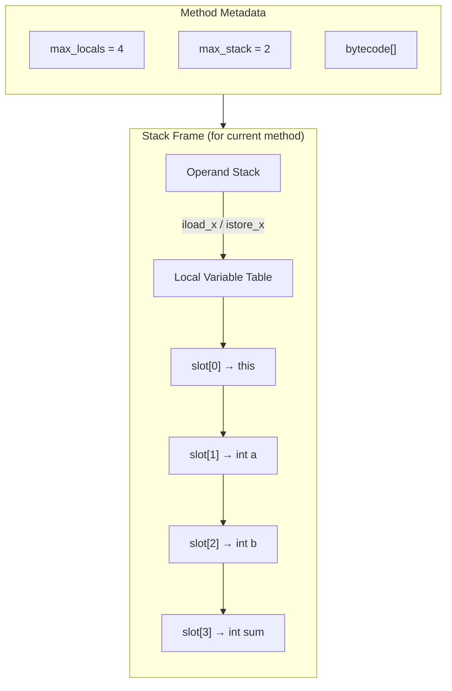
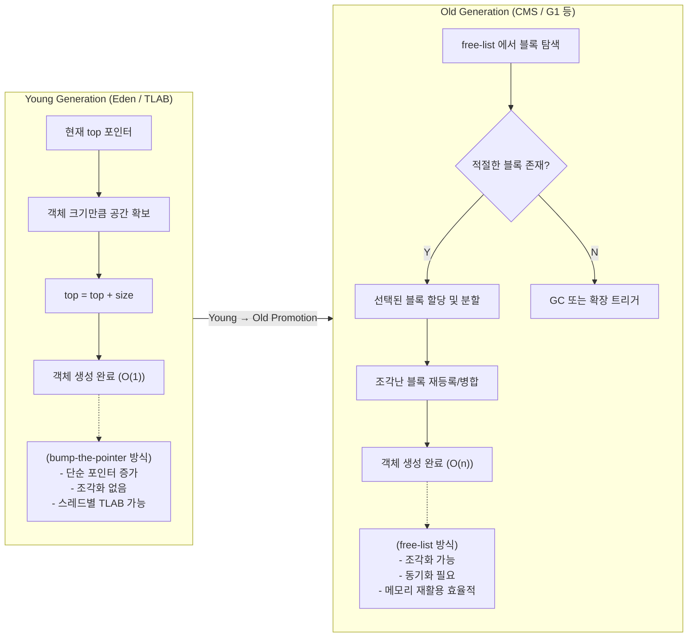
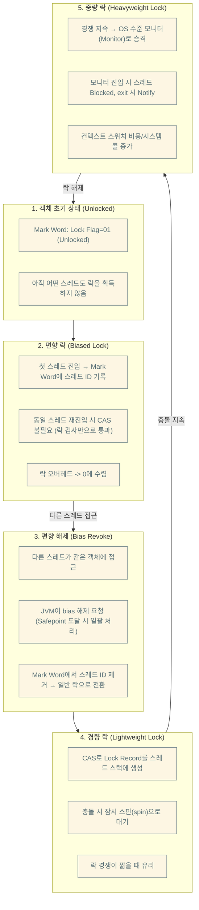

## #2.2
- 런타임 데이터 영역은 크게 모든 스레드가 공유하는 데이터 영역, Thread Private 영역으로 구분 됨
    - 런타임 데이터 영역에는 Method Area, (그리고 거기에 포함된 Runtime Constant Pool) Heap
    - Thread Private 영역은 JVM/Native Method 의 Stack, PC

### Program Counter
- OS의 PC Register 와 역할이 유사함
- CPU Core는 하나의 스레드 밖에 처리하지 못하고, 이는 JVM에서도 마찬가지
    - 참고로, JVM 스레드는 n개의 커널스레드를 m개의 JVM 스레드와 매핑하는 방식으로, n과 m이 다르기 때문에 1:1 매핑이 되지 않는다.
- `OutOfMemotyError` 조건이 명시되어 있지 않다.
- 네이티브 메서드 실행 중인 경우 PC 값은 `undefined` 이다.

### JVM Stack
- OS의 Stack과 유사하게, 메서드 호출 시 Stack Frame이 생성됨
    - 지역 변수 테이블, 피연산자 스택, 동적 링크, 메서드 반환값 등...
- 지역 변수 테이블에는 JVM의 컴파일 타임에 확인 가능한 primitive 타입, 객체 잠조, 반환 주소와 관련된 바이트코드 위치를 가리킴

- 지역 변수 테이블은 가변 크기를 고려하여, 고정적인 크기의 슬롯으로 구성되어 있다. (32비트이며, double 같은 64비트 데이터는 두 슬롯을 씀)
    - 시그니쳐의 특성상 컴파일 타임에 메서드마다 필요한 슬롯의 개수가 정해진다.
    - 단, 슬롯 크기는 JVM 구현체마다 다를 수 있다.
```cpp
// OpenJ9
#define J9STACKSLOT UDATA
```
- 스펙상, `StackoverflowError` 와 `OutOfMemoryError` 가 발생 가능하다.
    - 단, 후자는 JVM 중에서 스택 크기를 동적으로 조정 가능한 경우에만 해당하며, 핫스팟은 해당 사항 없음

### Native Method Stack
- JVM Stack과 유사하나, 바이트코드가 아닌 네이티브 코드 실행용
- 다만 JVM Specification 에서 구조를 명시하지 않았으므로, 구현체마다 실 구조는 제각각이다.
- HotSpot JVM 처럼 두 스택을 합쳐놓은 경우도 있다.
- 스펙상, 에러는 JVM Stack 과 동일하게 발생 가능하다.

### Java Heap
- JVM이 구동될 때 생성되는 가장 큰 메모리 영역
- 거의 모든 객체 인스턴스가 할당 (스펙에서는 "모든" 이라고 했지만, JIT의 발전으로 이젠 완벽하다고 할 수 없음)
- GC의 영향으로 Generational 한 영역으로 구분하곤 하지만, 스펙에는 이를 명시하지 않았음
    - 특히 현대 GC 알고리즘들은 대부분 Generational 한 구분을 하지 않기에, 더더욱 이에 얽매여선 안 됨
- 모두가 공유하는 메모리이므로, Thread-Local Allocation Buffer 여러개로 나눔. (TLAB)
- JVM 스펙에 따르면 물리적으로는 불연속적이어도 논리적으로는 연속적이어야 함 (like 가상메모리)
    - 단, 다수의 JVM은 배열과 같은 큰 객체는 물리적으로도 연속적으로 구현함.
- 힙 영역이 부족하면 1차로 GC를 수행하나, 그럼에도 용량이 부족하다면 `OutOfMemotyError` 를 던진다.

### Method Area
- JVM이 읽어들인 타입 정보, 상수, 정적 변수, 그리고 JIT 컴파일러에 의한 코드 캐시를 저장함.
- JVM Specification 에는 특별하게 해당 영역에 대한 제약을 두지 않음
- 기존 JVM에 있었던 Perm Area 랑은 다른 개념이지만, 수정이 적은 Method Area의 특성상 Perm Area에 구현했던 적이 존재함.
- 스펙상 GC가 불가능한 것은 아니지만 빈도가 적고, 한다고 해도 메모리적인 이득이 거의 없다. 하지만 그럼에도 불구하고, 필요하다.
    - 프레임워크 등에서 클래스를 직접 읽어서 로드하는 경우, Method Area의 영역이 점점 더 찰 수 있기 때문
    - 스펙상, `OutOfMemoryError` 가 발생 가능하다.
- 참고로, Method Area라는 표기는 JVM 스펙에 의한 용어이며, JVM 구현체마다 용어가 약간 다르다.
    - Hotspot 은 이를 Metaspace 라고 부른다. (https://wiki.openjdk.org/display/HotSpot/Metaspace)
    - Android Dalvik/ART 는 별도의 Class Space에 위치한다. (Native Heap 쪽)

### Runtime Constant Pool
- Method Area의 일부로, 클래스 버전, 필드, 메서드, 인터페이스 등 클래스 파일에 포함된 설명 정보에 컴파일타임에 생성된 다양한 리터럴과 심벌 참조가 저장됨.
- JVM이 클래스를 로드하는 타이밍에 이 정보를 Runtime Constant Pool에 저장함
- 스펙에 따르면 Constant Pool에 저장되는 데이터에 대한 정보가 엄격한 구성을 지켜야 하지만, 막상 Runtime Constant Pool에 대한 스펙은 불분명하여, JVM 구현체마다 구조가 약간 다름.
- 자바는 특성상 모든 상수가 컴파일 타임에 구성될 필요가 없기에, 클래스 파일에 명시된 Constant Pool 에 꼭 상수 정보가 다 들어갈 필요가 없음.

### Direct Memory
- 엄밀히 말하면 JVM 메모리도 아니고, 스펙에도 명시되어 있지 않음.
- NIO가 도입된 이후, JVM 내부 힙을 거치지 않고 메모리를 다이렉트로 접근할 수 있는 방법들이 생겼는데, 이 메모리에 저장된 `DirectByteBuffer` 객체를 통한 작업을 수행 가능하게 됨.
- 다만 이 또한 메모리이기 때문에, JVM 힙 크기 할당과 별개로 물리 메모리 영역의 합을 고려하지 않으면, JVM 에서 `OutOfMemory` 가 발생할 수 있다.

## 2.3 핫스팟 가상 머신에서의 객체 들여다보기
* OpenJ9 과 같은 다른 JVM 의 구조는 다를 수 있으나, 대부분 Hotspot 을 쓰는 만큼... 크게 고민할 부분은 아니라고 생각한다.

### 객체 생성

```mermaid
flowchart TD
    A[new 바이트코드 실행] --> B{심볼 참조 유효?}
    B -->|No| C[ClassNotFoundException/<br/>NoClassDefFoundError]:::err
    B -->|Yes| D{클래스 로드됨?}

    D -->|No| E[클래스 로딩]
    D -->|Yes| F{클래스 초기화됨?}
    E --> F

    F -->|No| G[클래스 초기화<br/>&#40;static 블록 실행&#41;]
    F -->|Yes| H[힙 메모리 할당]
    G --> H
    
    H --> I{메모리 할당 성공?}
    I -->|No| J[OutOfMemoryError]:::err
    I -->|Yes| K[인스턴스 변수<br/>기본값으로 초기화<br/>&#40;0/false/null&#41;]
    
    K --> L[객체 헤더 설정<br/>&#40;클래스 메타데이터,<br/>해시코드, GC 정보&#41;]
    
    L --> M[객체 참조를<br/>오퍼랜드 스택에 push]
    
    M --> N[완료<br/>&#40;이후 &#60;init&#62; 생성자 호출&#41;]

    classDef err fill:#fee,border:#f99,color:#900

```


- 메모리를 할당하는 과정은 여러 방법이 있다.
    - 만약 메모리가 연속적이고 규칙적이라면 "bump the point" 전략을 사용할 수 있겠지만, 현실적인 메모리 구조는 그렇지 않으니 어려울 것이다.
    - JVM은 가용 메모리 블럭을 따로 관리하며, 이를 free-list 라고 한다.
- 객체 생성과 관련한 멀티스레딩 문제가 존재한다. (여유 메모리의 시작 포인터 관점에서)
    - CAS 를 사용하여 Lock-Free 하게 문제를 해결할 수도 있고,
    - 각각의 스레드가 자바 힙 내 TLAB를 별도로 할당 받아 사용한다.
        - 이 경우, 부족해지면 동기화를 해 새로운 버퍼를 할당 받는다.
- 참고로, 구세대 GC인 G1 GC에서는 두 기법을 모두 혼용해서 사용했다.



### 객체의 메모리 레이아웃
- HotSpot JVM은 객체를 세 부분으로 나눈다.
    - 객체 헤더, 인스턴스 데이터, padding
- 헤더는 두 가지 정보를 담는다.
    - 객체 자체의 런타임 데이터 (hashCode, GC Gen, Lock Flag, 스레드가 점유하고 있는 락들, biased thread의 아이디와 timestamp)
    - biased lock 이란, JVM의 락 최적화 알고리즘 중 하나로, **경험적인** Lock-Free 전략을 취하는 것이다.

    - 다만, 현재는 Deprecated 되었다. (https://openjdk.org/jeps/374)
- 용량의 효율화를 위해, 25비트는 객체 해시코드, 4비트는 GC Gen의 age, 1비트는 0, 2비트는 Lock flag로 관리
- 이어서 오는 klass word는 클래스 관련 메타데이터를 가리키는 클래스 포인터가 저장됨
- 모든 가상 머신 구현이 클래스 포인터를 헤더에 저장하진 않음
- 배열은 길이도 헤더에 같이 저장되며, 그 정보는 klass header 바로 다음이다.
- 인스턴스 데이터는 실제로 담고 있는 정보이다.
    - 필드 관련 내용, 부모 클래스 유무, 부모 클래스에서 정의한 모든 필드 등등...
    - JVM의 할당 전략 매개 변수 파라미터 및 소스 코드 정의에 따라 달라짐.
    - 기본 전략의 경우, 크기가 같으면 이어서 저장된다.
    - `+XX:CompactFields` 가 `true` 인 경우, 길이가 짧은 하위 클래스는 사이사이에 끼워들어간다.
- Padding
    - JVM은 8바이트 단위의 정수배로 관리되기 때문에 필요에 따라 Padding이 추가된다.

### 객체 접근
- 자바 프로그램은 스택에 있는 참조를 통해 이를 객체 접근하고 조작함.
- 다만 JVM 스펙상 접근 방식에 대한 구체적인 언급이 없으므로, JVM 구현체마다 약간씩 다르다.
- 핸들 방식을 사용하는 경우, 자바 힙에 핸들 저장용 풀이 별도로 존재한다.
    - 핸들에는 해당 객체의 인스턴스 데이터의 참조와 Method Area에 존재하는 해당 객체의 데이터에 대한 참조가 있을 것이다.
    - 참조에 안정적인 핸들의 주소가 저장되어 GC 과정에서 객체가 이동되어도 참조 자체를 손댈 필요가 없어진다. (핸들이 가리키고 있는 인스턴스 주소만 변경하면 되므로)
- 다이렉트 포인터 방식을 사용하는 경우, 스택이 다이렉트로 객체의 인스턴스를 가리키고 있고, 해당 데이터 안에 Method Area의 포인터가 있다.
    - 속도 측면에서 참조 횟수가 줄어드므로 빠르다.
- HotSpot은 다이렉트 방식 사용
